# Management & Culture

<p align="center">
  
  
  
</p>

> **Building high-performing engineering teams through intentional culture, clear ownership, and scalable processes.**

This repository contains frameworks, philosophies, and practical guides for engineering leadership-distilled from years of experience scaling teams and delivering results.

---

## The Developer Lifecycle

```mermaid
%%{init: {'theme': 'base', 'themeVariables': { 'primaryColor': '#6366f1', 'primaryTextColor': '#fff', 'primaryBorderColor': '#4f46e5', 'lineColor': '#64748b', 'secondaryColor': '#f1f5f9'}}}%%
flowchart LR
    subgraph ONBOARDING["🚀 ONBOARDING"]
        direction TB
        A["👀 Week 1<br/>Observe"]
        B["🔧 Week 2<br/>Practice"]
        C["🌐 Week 3<br/>Expand"]
        D["🎯 Week 4<br/>Lead"]
        A --> B --> C --> D
    end
    
    subgraph GROWTH["📈 GROWTH"]
        direction TB
        E["👥 Pair<br/>Programming"]
        F["📦 Code<br/>Ownership"]
        G["🏗️ Technical<br/>Leadership"]
        H["🌟 Mentorship"]
        E --> F --> G --> H
    end
    
    subgraph EXCELLENCE["🏆 EXCELLENCE"]
        direction TB
        I["🚢 Ship<br/>Features"]
        J["⚙️ Own<br/>Systems"]
        K["📐 Define<br/>Standards"]
        L["👨‍👩‍👧‍👦 Build<br/>Teams"]
        I --> J --> K --> L
    end
    
    D -.->|"Graduate"| E
    H -.->|"Evolve"| I
    L -.->|"♻️ Mentor Next Gen"| A
    
    style ONBOARDING fill:#fef3c7,stroke:#f59e0b,stroke-width:3px,color:#92400e
    style GROWTH fill:#ede9fe,stroke:#8b5cf6,stroke-width:3px,color:#5b21b6
    style EXCELLENCE fill:#d1fae5,stroke:#10b981,stroke-width:3px,color:#065f46
    
    style A fill:#fcd34d,stroke:#f59e0b,color:#78350f
    style B fill:#fcd34d,stroke:#f59e0b,color:#78350f
    style C fill:#fcd34d,stroke:#f59e0b,color:#78350f
    style D fill:#fcd34d,stroke:#f59e0b,color:#78350f
    
    style E fill:#c4b5fd,stroke:#8b5cf6,color:#4c1d95
    style F fill:#c4b5fd,stroke:#8b5cf6,color:#4c1d95
    style G fill:#c4b5fd,stroke:#8b5cf6,color:#4c1d95
    style H fill:#c4b5fd,stroke:#8b5cf6,color:#4c1d95
    
    style I fill:#6ee7b7,stroke:#10b981,color:#064e3b
    style J fill:#6ee7b7,stroke:#10b981,color:#064e3b
    style K fill:#6ee7b7,stroke:#10b981,color:#064e3b
    style L fill:#6ee7b7,stroke:#10b981,color:#064e3b
```



---

## Repository Structure

```
management-and-culture/
├── MY_USER_MANUAL.md           # How to work with Vadym
├── management/                 # People & process frameworks
├── culture/                    # Engineering culture & standards
├── technical-strategy/         # Code ownership & governance
└── incident-management/        # Post-mortem & failure handling
```

---

## Working With Me

> **Start here if you're joining my team.**

| Document | Description |
|:---|:---|
| [My User Manual](./MY_USER_MANUAL.md) | How I communicate, what I value, and how to give me feedback |

---

## Management

Frameworks for developing people and running effective teams.

| Document | Description |
|:---|:---|
| [1-on-1 Framework](./management/1-on-1-framework.md) | Structured meeting format for meaningful manager-report conversations |
| [Onboarding Philosophy](./management/onboarding-philosophy.md) | 4-week high-touch immersion program with pair programming |

### Key Principles

- **Ownership over checklist** - Teams define their social fabric
- **High-touch onboarding** - 4 weeks of structured pair programming
- **Gradual autonomy** - From observation to leadership

---

## Culture

Standards and philosophies that define how we work together.

| Document | Description |
|:---|:---|
| [Engineering Standards](./culture/engineering-standards.md) | Code style, Scout Rule, blameless post-mortems, ADRs |
| [Ownership Model](./culture/ownership-model.md) | Stewardship over gatekeeping, anti-bottleneck strategies |

### Key Principles

- **Stewardship > Gatekeeping** - Owners mentor, not block
- **Automated consistency** - Let linters handle style debates
- **Blameless culture** - Systems fail, not people
- **Default to public** - Context should be searchable

---

## Technical Strategy

Governance structures for code quality and team scalability.

| Document | Description |
|:---|:---|
| [Code Guardianship](./technical-strategy/code-guardianship.md) | CODEOWNERS structure with tiered ownership |

### Key Principles

- **Clear accountability** - Every file has a defined owner
- **Appropriate expertise** - Critical paths get senior review
- **Reduced cognitive load** - Automated PR assignment
- **Safety nets** - Ship fast within guardrails

---

## Incident Management

How we handle failures and turn them into improvements.

| Document | Description |
|:---|:---|
| [Post-Mortem Template](./incident-management/post-mortem-template.md) | Blameless incident analysis with Five Whys and action items |

### Key Principles

- **Blameless by default** - We examine systems, not individuals
- **Every incident is a gift** - Opportunities for systemic improvement
- **Action-oriented** - Every post-mortem produces concrete fixes
- **Transparent sharing** - Learnings benefit the entire organization

---

## Philosophy Summary

```mermaid
%%{init: {'theme': 'base', 'themeVariables': { 'primaryColor': '#6366f1', 'primaryTextColor': '#fff', 'primaryBorderColor': '#4f46e5', 'lineColor': '#94a3b8', 'secondaryColor': '#f1f5f9', 'tertiaryColor': '#fafafa'}}}%%
flowchart TB
    subgraph INPUTS["💡 INPUTS"]
        direction LR
        A["🎯 Autonomy"]
        B["📋 Accountability"]
    end
    
    subgraph PRACTICES["⚙️ PRACTICES"]
        direction LR
        C["👥 Clear Ownership"]
        D["🛡️ Blameless Culture"]
        E["📚 Continuous Learning"]
    end
    
    subgraph OUTCOMES["🏆 OUTCOMES"]
        direction LR
        F["🚀 High-Performing Teams"]
        G["⚡ Sustainable Velocity"]
        H["✨ Engineering Excellence"]
    end
    
    A --> C
    A --> D
    B --> C
    B --> E
    C --> F
    D --> G
    E --> H
    
    style INPUTS fill:#fef3c7,stroke:#f59e0b,stroke-width:2px,color:#92400e
    style PRACTICES fill:#dbeafe,stroke:#3b82f6,stroke-width:2px,color:#1e40af
    style OUTCOMES fill:#d1fae5,stroke:#10b981,stroke-width:2px,color:#065f46
    style A fill:#fbbf24,stroke:#f59e0b,color:#78350f
    style B fill:#fbbf24,stroke:#f59e0b,color:#78350f
    style C fill:#60a5fa,stroke:#3b82f6,color:#1e3a8a
    style D fill:#60a5fa,stroke:#3b82f6,color:#1e3a8a
    style E fill:#60a5fa,stroke:#3b82f6,color:#1e3a8a
    style F fill:#34d399,stroke:#10b981,color:#064e3b
    style G fill:#34d399,stroke:#10b981,color:#064e3b
    style H fill:#34d399,stroke:#10b981,color:#064e3b
```



### The Goal

> **Build systems so robust and teams so informed that leadership presence is a luxury, not a requirement.**

---

## Quick Start

| If you are... | Start with... |
|:---|:---|
| **Joining my team** | [My User Manual](./MY_USER_MANUAL.md) |
| **A new manager** | [1-on-1 Framework](./management/1-on-1-framework.md) |
| **A team lead** | [Ownership Model](./culture/ownership-model.md) |
| **An architect** | [Code Guardianship](./technical-strategy/code-guardianship.md) |
| **Handling an incident** | [Post-Mortem Template](./incident-management/post-mortem-template.md) |
| **Everyone** | [Engineering Standards](./culture/engineering-standards.md) |

---

## About

These documents represent battle-tested approaches to engineering leadership, developed through scaling teams, shipping products, and learning from both successes and failures.

**Core beliefs:**
- Great teams are built, not hired
- Culture is what you do, not what you say
- Processes should enable, not constrain
- Documentation beats tribal knowledge
- Failures are investments in future resilience

---

<sub>**Vadym Shukurov** | Engineering Leadership</sub>
