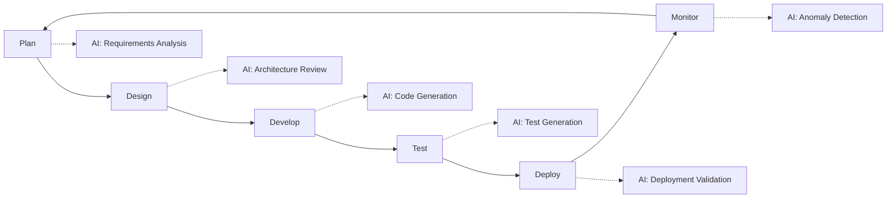

# AI-Enhanced SDLC Guide

> **"Shift left with AI-catch defects earlier, ship faster, maintain quality."**

This guide defines how AI tools integrate into each phase of our Software Development Lifecycle to maximize productivity while maintaining engineering excellence.

---

## The AI-Enhanced SDLC



---

## Phase 1: Planning

### AI-Assisted Activities

| Activity | AI Application | Human Responsibility |
|:---|:---|:---|
| Requirements Analysis | Parse user stories for ambiguity | Final requirement sign-off |
| Effort Estimation | Historical pattern analysis | Adjustment for context |
| Risk Identification | Pattern matching from past incidents | Risk prioritization |
| Dependency Mapping | Codebase impact analysis | Architecture decisions |

### Prompts for Planning

```markdown
## Requirements Clarity Check
"Review this user story for ambiguity, missing acceptance criteria, 
and edge cases: [paste story]"

## Effort Estimation
"Based on this task description, identify complexity factors and 
potential blockers: [paste task]"

## Impact Analysis
"What areas of the codebase might be affected by implementing 
this feature: [paste feature description]"
```

### Quality Gates

- [ ] AI analysis reviewed by Product Owner
- [ ] Estimates validated by technical lead
- [ ] Risks discussed in sprint planning

---

## Phase 2: Design

### AI-Assisted Activities

| Activity | AI Application | Human Responsibility |
|:---|:---|:---|
| Architecture Review | Pattern validation, anti-pattern detection | Architecture decisions |
| API Design | Schema generation, consistency checks | API contracts |
| Database Design | Schema optimization suggestions | Data model ownership |
| Security Review | Threat model generation | Security sign-off |

### Prompts for Design

```markdown
## Architecture Review
"Review this system design for scalability issues, single points 
of failure, and security concerns: [paste design]"

## API Design
"Generate an OpenAPI schema for this endpoint with proper error 
handling and validation: [paste requirements]"

## Database Schema
"Suggest indexes and optimizations for this schema based on 
these query patterns: [paste schema + queries]"
```

### Quality Gates

- [ ] AI suggestions reviewed by senior engineer
- [ ] Architecture Decision Record (ADR) created
- [ ] Security review for sensitive components

---

## Phase 3: Development

### AI-Assisted Activities

| Activity | AI Application | Human Responsibility |
|:---|:---|:---|
| Code Generation | Boilerplate, utilities, patterns | Code ownership |
| Code Completion | Real-time suggestions | Accept/reject decisions |
| Refactoring | Optimization suggestions | Final implementation |
| Documentation | Inline comments, READMEs | Accuracy validation |

### The 80/20 Rule

```
AI writes the "commodity" 80%:
├── Boilerplate and scaffolding
├── Standard CRUD operations
├── Test setup and teardown
├── Documentation templates
└── Type definitions

Human writes the "differentiated" 20%:
├── Core business logic
├── Complex algorithms
├── Security-sensitive code
├── Performance-critical paths
└── Integration decisions
```

### Code Review Integration

| AI Role | Human Role |
|:---|:---|
| Pre-review checks (linting, formatting) | Final approval |
| Bug pattern detection | Context evaluation |
| Security vulnerability scanning | Risk assessment |
| Documentation completeness | Accuracy verification |

### Quality Gates

- [ ] All AI-generated code reviewed same as human code
- [ ] Author can explain every line
- [ ] Security scan passed
- [ ] Test coverage maintained

---

## Phase 4: Testing

### AI-Assisted Activities

| Activity | AI Application | Human Responsibility |
|:---|:---|:---|
| Unit Test Generation | Test case scaffolding | Test quality validation |
| Test Data Generation | Synthetic data creation | Data accuracy |
| Edge Case Identification | Boundary condition analysis | Prioritization |
| Test Maintenance | Flaky test detection | Fix decisions |

### Test Generation Workflow

```
1. Human writes the implementation
2. AI generates initial test suite
3. Human reviews and enhances tests
4. AI identifies missing edge cases
5. Human adds critical test scenarios
6. AI maintains test documentation
```

### Prompts for Testing

```markdown
## Unit Test Generation
"Generate comprehensive unit tests for this function including 
edge cases, error handling, and boundary conditions: [paste code]"

## Test Data Generation
"Create synthetic test data that covers these scenarios without 
using any real customer information: [paste requirements]"

## Edge Case Analysis
"What edge cases and failure modes should be tested for this 
feature: [paste feature description]"
```

### Quality Gates

- [ ] AI-generated tests reviewed for correctness
- [ ] Coverage targets met (85% for new code)
- [ ] Edge cases validated by domain expert
- [ ] No PII in test data

---

## Phase 5: Deployment

### AI-Assisted Activities

| Activity | AI Application | Human Responsibility |
|:---|:---|:---|
| Release Notes | Change summarization | Final editing |
| Deployment Validation | Config verification | Deployment approval |
| Rollback Analysis | Impact assessment | Rollback decision |
| Runbook Generation | Procedure documentation | Accuracy validation |

### Pre-Deployment Checklist

AI can assist with verification:

- [ ] All tests passing
- [ ] No security vulnerabilities
- [ ] Config validated for environment
- [ ] Dependencies up to date
- [ ] Database migrations reviewed
- [ ] Feature flags configured
- [ ] Rollback plan documented

### Quality Gates

- [ ] Human approval for production deployments
- [ ] Change advisory board review for major releases
- [ ] Runbook verified by on-call engineer

---

## Phase 6: Monitoring

### AI-Assisted Activities

| Activity | AI Application | Human Responsibility |
|:---|:---|:---|
| Anomaly Detection | Pattern deviation alerts | Alert triage |
| Log Analysis | Error pattern identification | Root cause analysis |
| Performance Analysis | Trend identification | Optimization decisions |
| Incident Response | Suggested remediation | Action execution |

### Observability Integration

```
Logs → AI Analysis → Suggested Actions → Human Decision

Metrics → AI Anomaly Detection → Alert → Human Triage

Traces → AI Pattern Matching → Bottleneck ID → Human Fix
```

### Quality Gates

- [ ] AI alerts reviewed by on-call
- [ ] False positive rate monitored
- [ ] Remediation suggestions validated before execution

---

## Metrics & KPIs

### Measuring AI Impact

| Metric | Target | How AI Helps |
|:---|:---|:---|
| **Lead Time** | 20% reduction | Faster code generation |
| **Defect Escape Rate** | 50% reduction | Earlier detection |
| **Test Coverage** | 85%+ on new code | Automated test generation |
| **Documentation Coverage** | 100% public APIs | Automated doc generation |
| **Time to Resolution** | 30% reduction | Faster root cause analysis |

### Tracking Dashboard

```
┌─────────────────────────────────────────────────────────────┐
│                   AI-ENHANCED SDLC METRICS                  │
├─────────────────────────────────────────────────────────────┤
│                                                             │
│  Code Generation        Testing                Deployment   │
│  ────────────────       ───────                ──────────   │
│  AI Suggestions: 1.2K   Tests Generated: 340   Deploy Time  │
│  Accepted: 78%          Coverage Δ: +12%       -15% avg     │
│                                                             │
│  Review Time            Defects                 MTTR        │
│  ───────────            ───────                 ────        │
│  -25% avg               Pre-prod: +40%         -22% avg     │
│                         Escaped: -35%                       │
│                                                             │
└─────────────────────────────────────────────────────────────┘
```

---

## Anti-Patterns to Avoid

| Anti-Pattern | Why It's Harmful | Better Approach |
|:---|:---|:---|
| **Blind Acceptance** | AI makes plausible mistakes | Review every suggestion |
| **Over-Reliance** | Skills atrophy, context lost | Use AI as assistant, not autopilot |
| **Skipping Reviews** | AI code has same bug potential | Same review standards |
| **Copy-Paste Coding** | Security risks, license issues | Understand before using |
| **Prompt Leaking** | Sensitive data exposure | Sanitize all inputs |

---

## Implementation Roadmap

### Phase 1: Foundation (Month 1-2)
- [ ] Approve AI tools and configure enterprise settings
- [ ] Train teams on acceptable use policy
- [ ] Integrate AI into local development environments

### Phase 2: Integration (Month 3-4)
- [ ] Add AI checks to CI/CD pipeline
- [ ] Implement AI-assisted code review
- [ ] Deploy AI-powered monitoring

### Phase 3: Optimization (Month 5-6)
- [ ] Measure and report AI impact metrics
- [ ] Refine prompts and workflows
- [ ] Share best practices across teams

### Phase 4: Scale (Ongoing)
- [ ] Expand to additional use cases
- [ ] Evaluate new AI tools
- [ ] Continuous policy refinement

---

<sub>**Management & Culture** | Vadym Shukurov</sub>
