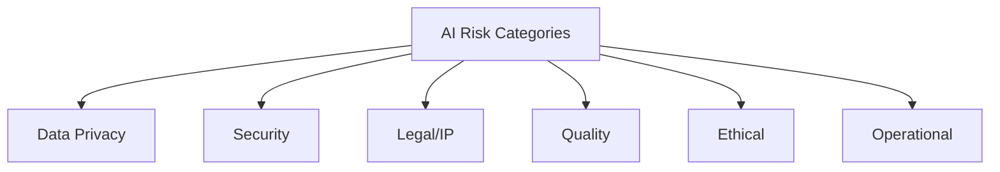

# AI Compliance & Risk Matrix

> **"Move fast, but know the risks you're taking."**

This matrix provides a comprehensive view of AI-related risks, compliance requirements, and mitigation strategies for engineering teams.

---

## Risk Categories Overview



---

## Risk Matrix

### Data Privacy Risks

| Risk | Likelihood | Impact | Risk Level | Mitigation |
|:---|:---:|:---:|:---:|:---|
| PII exposure to AI vendors | High | Critical | **Critical** | Data sanitization policy, DLP tools |
| Training on customer data | Medium | Critical | **High** | Enterprise tiers with opt-out |
| Cross-border data transfer | Medium | High | **High** | Vendor compliance verification |
| Data retention by AI vendors | Medium | Medium | **Medium** | Review vendor data policies |
| Inference attacks on AI models | Low | High | **Medium** | Input/output monitoring |

### Security Risks

| Risk | Likelihood | Impact | Risk Level | Mitigation |
|:---|:---:|:---:|:---:|:---|
| Credential exposure in prompts | High | Critical | **Critical** | Pre-commit hooks, education |
| Vulnerable code generation | Medium | High | **High** | Security scanning, code review |
| Prompt injection attacks | Medium | High | **High** | Input validation, sandboxing |
| Supply chain vulnerabilities | Medium | Medium | **Medium** | Dependency scanning |
| Shadow AI tool usage | High | Medium | **High** | Approved tool list, monitoring |

### Legal & IP Risks

| Risk | Likelihood | Impact | Risk Level | Mitigation |
|:---|:---:|:---:|:---:|:---|
| License violation in generated code | Medium | High | **High** | License scanning, enterprise tools |
| Copyright infringement claims | Low | High | **Medium** | Indemnification clauses |
| Proprietary code exposure | Medium | Critical | **High** | Acceptable use policy |
| Patent complications | Low | Medium | **Low** | Disclosure requirements |
| Contract violations | Low | High | **Medium** | Legal review of AI clauses |

### Quality Risks

| Risk | Likelihood | Impact | Risk Level | Mitigation |
|:---|:---:|:---:|:---:|:---|
| Incorrect/buggy code accepted | High | High | **High** | Mandatory code review |
| Subtle logic errors | Medium | High | **High** | Comprehensive testing |
| Technical debt accumulation | Medium | Medium | **Medium** | Architecture review |
| Skills atrophy in team | Medium | Medium | **Medium** | Training, manual practice |
| Over-reliance on AI | Medium | Medium | **Medium** | Human-in-the-loop requirements |

### Ethical Risks

| Risk | Likelihood | Impact | Risk Level | Mitigation |
|:---|:---:|:---:|:---:|:---|
| Biased outputs | Medium | Medium | **Medium** | Output review, diverse testing |
| Inappropriate content generation | Low | High | **Medium** | Content filtering, review |
| Misuse for deception | Low | High | **Medium** | Acceptable use policy |
| Displacement anxiety in team | Medium | Medium | **Medium** | Communication, upskilling |
| Environmental impact | Low | Low | **Low** | Efficient usage patterns |

### Operational Risks

| Risk | Likelihood | Impact | Risk Level | Mitigation |
|:---|:---:|:---:|:---:|:---|
| AI service outages | Medium | Medium | **Medium** | Fallback procedures |
| Vendor lock-in | Medium | Medium | **Medium** | Multi-vendor strategy |
| Cost overruns | Medium | Low | **Low** | Usage monitoring, budgets |
| Inconsistent output quality | High | Low | **Medium** | Prompt standardization |
| Audit trail gaps | Medium | Medium | **Medium** | Logging, documentation |

---

## Compliance Requirements by Regulation

### GDPR (EU)

| Requirement | AI Implication | Compliance Action |
|:---|:---|:---|
| **Data Minimization** | Don't send unnecessary data to AI | Sanitization checklist |
| **Purpose Limitation** | AI usage must align with consent | Document AI use cases |
| **Right to Erasure** | AI vendors must delete data | Verify vendor compliance |
| **Data Processing Agreement** | Contract with AI vendor | Legal review of terms |
| **Cross-Border Transfer** | US-based AI services | Standard contractual clauses |

### CCPA (California)

| Requirement | AI Implication | Compliance Action |
|:---|:---|:---|
| **Right to Know** | Disclose AI data processing | Privacy policy updates |
| **Right to Delete** | Remove data from AI systems | Vendor data deletion process |
| **Opt-Out Rights** | Respect user preferences | Granular consent management |
| **Service Provider Rules** | AI vendor classification | Contract language review |

### SOC 2

| Trust Principle | AI Consideration | Control |
|:---|:---|:---|
| **Security** | AI tool access controls | SSO, role-based access |
| **Availability** | AI dependency management | Fallback procedures |
| **Processing Integrity** | AI output validation | Review processes |
| **Confidentiality** | Data protection in transit | Encryption, sanitization |
| **Privacy** | PII handling | Data classification |

### HIPAA (Healthcare)

| Requirement | AI Restriction | Compliance Action |
|:---|:---|:---|
| **PHI Protection** | No PHI in AI prompts | Strict prohibition policy |
| **Business Associate** | AI vendor must be BA | BAA requirement |
| **Minimum Necessary** | Limit data to needed | Data minimization |
| **Audit Controls** | Track AI usage | Logging and monitoring |

### PCI-DSS (Payments)

| Requirement | AI Restriction | Compliance Action |
|:---|:---|:---|
| **Cardholder Data** | No card data in prompts | Absolute prohibition |
| **Access Control** | Limit AI tool access | Role-based permissions |
| **Audit Trail** | Log AI interactions | Comprehensive logging |
| **Vendor Management** | Assess AI vendor risk | Annual review |

---

## Vendor Risk Assessment

### Evaluation Criteria

| Category | Weight | Questions to Ask |
|:---|:---:|:---|
| **Data Handling** | 30% | Where is data processed? Retention policy? |
| **Security** | 25% | SOC 2? Encryption? Access controls? |
| **Compliance** | 20% | GDPR compliant? Industry certifications? |
| **Training Policy** | 15% | Is customer data used for training? |
| **Contractual** | 10% | Indemnification? Liability? SLA? |

### Vendor Comparison Template

| Vendor | Data Residency | Training Opt-Out | SOC 2 | Indemnification | Enterprise SSO |
|:---|:---:|:---:|:---:|:---:|:---:|
| Vendor A | US/EU | Yes | Yes | Yes | Yes |
| Vendor B | US | Yes | Yes | Limited | Yes |
| Vendor C | Global | No | No | No | No |

### Approved Vendor Tiers

| Tier | Description | Allowed Data |
|:---|:---|:---|
| **Tier 1** | Enterprise contract, full compliance | Internal code, sanitized data |
| **Tier 2** | Business tier, partial compliance | Non-sensitive code only |
| **Tier 3** | Free tier, limited compliance | Public information only |
| **Prohibited** | No enterprise features | Nothing |

---

## Control Framework

### Preventive Controls

| Control | Purpose | Implementation |
|:---|:---|:---|
| **Data Classification** | Identify sensitive data | Labeling system |
| **Access Control** | Limit AI tool access | SSO, role-based |
| **Input Validation** | Prevent sensitive data leakage | Pre-commit hooks |
| **Training** | Educate on risks | Mandatory onboarding |
| **Approved Tool List** | Reduce shadow AI | Published and enforced |

### Detective Controls

| Control | Purpose | Implementation |
|:---|:---|:---|
| **Usage Monitoring** | Track AI interactions | Logging, dashboards |
| **Anomaly Detection** | Identify unusual patterns | Alert rules |
| **Code Scanning** | Find vulnerable AI output | SAST/DAST integration |
| **Audit Reviews** | Verify compliance | Quarterly audits |
| **Incident Tracking** | Learn from issues | Incident log |

### Corrective Controls

| Control | Purpose | Implementation |
|:---|:---|:---|
| **Incident Response** | Handle AI-related incidents | Playbook |
| **Policy Violations** | Address misuse | Escalation process |
| **Vendor Issues** | Manage vendor failures | Contingency plans |
| **Remediation** | Fix identified gaps | Action tracking |

---

## Incident Response for AI

### AI-Specific Incident Types

| Incident Type | Severity | Response |
|:---|:---:|:---|
| PII sent to AI tool | Critical | Immediate report to Security, vendor notification |
| Credentials exposed | Critical | Rotate immediately, assess blast radius |
| Vulnerable code deployed | High | Rollback, patch, post-mortem |
| License violation detected | Medium | Legal review, remediation plan |
| Shadow AI tool discovered | Medium | Policy reminder, tool evaluation |

### Response Playbook

```
1. IDENTIFY
   - What data/code was exposed?
   - Which AI tool was involved?
   - What was the business context?

2. CONTAIN
   - Stop further exposure
   - Rotate any exposed credentials
   - Preserve evidence

3. NOTIFY
   - Security team (immediately)
   - Legal (if compliance impact)
   - Management (per severity)
   - Vendor (if needed for data deletion)

4. REMEDIATE
   - Address immediate risk
   - Implement additional controls
   - Document lessons learned

5. REVIEW
   - Post-mortem (blameless)
   - Policy updates if needed
   - Training reinforcement
```

---

## Audit Checklist

### Quarterly Review

- [ ] Review AI tool usage reports
- [ ] Verify approved tool list is current
- [ ] Check for policy violations
- [ ] Assess new AI tools for compliance
- [ ] Review vendor compliance status
- [ ] Update risk assessments
- [ ] Test incident response procedures

### Annual Review

- [ ] Full vendor risk reassessment
- [ ] Policy effectiveness evaluation
- [ ] Training program update
- [ ] Compliance certification maintenance
- [ ] Control framework assessment
- [ ] Emerging risk identification

---

## Quick Reference: Risk Decision Tree

```
┌─────────────────────────────────────────────────────────────┐
│                   AI USAGE DECISION TREE                    │
├─────────────────────────────────────────────────────────────┤
│                                                             │
│  Does the input contain PII or credentials?                 │
│  ├── YES → ❌ DO NOT USE AI                                 │
│  └── NO ↓                                                   │
│                                                             │
│  Is it proprietary/confidential business logic?             │
│  ├── YES → ❌ DO NOT USE AI (or sanitize heavily)          │
│  └── NO ↓                                                   │
│                                                             │
│  Is the AI tool on the approved list?                       │
│  ├── NO → ❌ DO NOT USE (request evaluation)               │
│  └── YES ↓                                                  │
│                                                             │
│  Are you using the enterprise/business tier?                │
│  ├── NO → ⚠️ Limited to public information only            │
│  └── YES ↓                                                  │
│                                                             │
│  ✅ PROCEED with standard review processes                  │
│                                                             │
└─────────────────────────────────────────────────────────────┘
```

---

## Governance Structure

| Role | Responsibility |
|:---|:---|
| **AI Governance Lead** | Policy ownership, vendor management |
| **Security Team** | Risk assessment, incident response |
| **Legal/Compliance** | Regulatory alignment, contracts |
| **Engineering Leads** | Policy enforcement, training |
| **All Engineers** | Policy compliance, incident reporting |

---

<sub>**Management & Culture** | Vadym Shukurov</sub>
